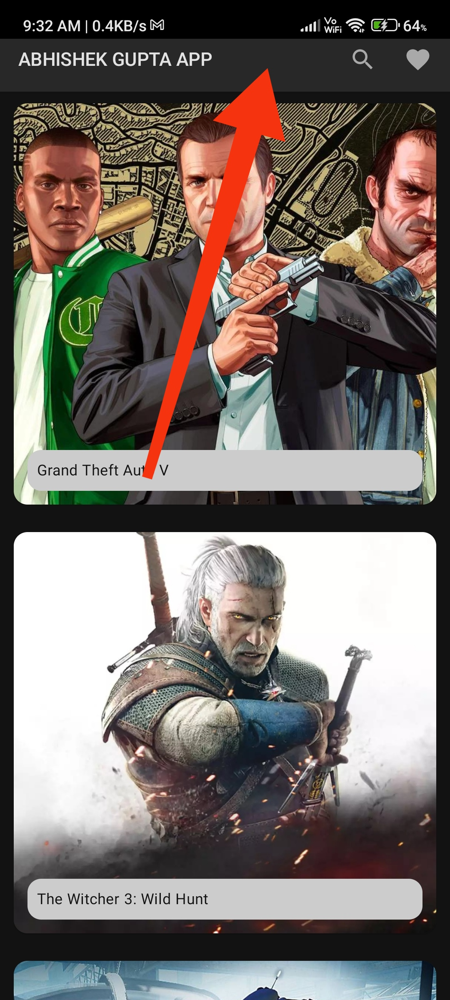
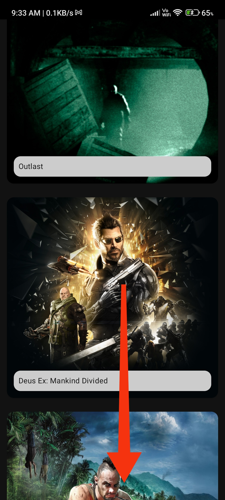
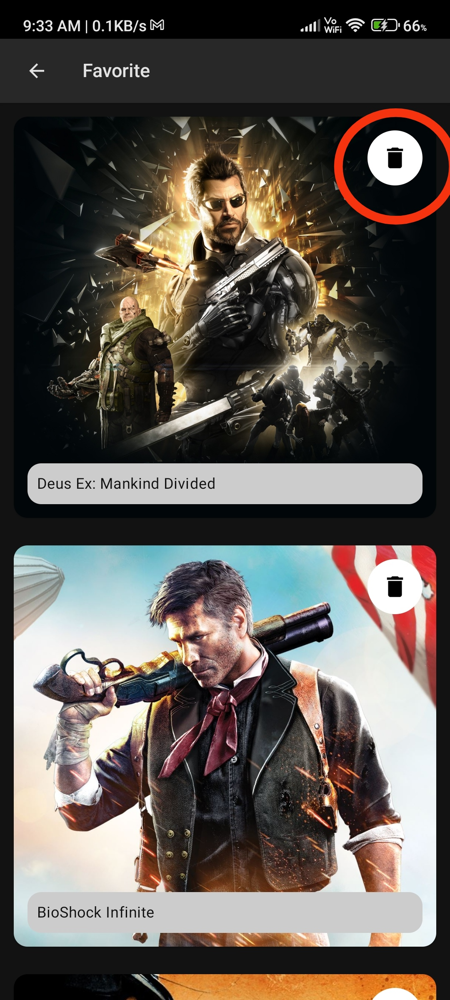
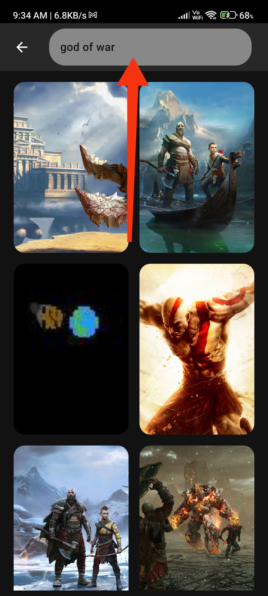

# 🎮 Game Search App - KMM

A cross-platform (Android + iOS) **Game Search App** built using **Kotlin Multiplatform Mobile (KMM)** and powered by the [RAWG Video Games Database API](https://rawg.io/apidocs). This app helps users search, browse, and favorite their favorite games across platforms.

---

## 🚀 Features

- 🔍 Search and display list of games using **RAWG API**
- ⚡ Built with **Ktor Client** for networking
- 📄 Paginated game list using **Jetpack Paging**
- 🗃️ Local storage with **SQLDelight**
- ❤️ Mark games as favorites (stored locally)
- 🧪 Dependency Injection with **Koin**
- 🌗 Dynamic Theme Support (Dark / Light Mode)
- ⬇️ Collapsable TopAppBar with motion effects
- 📱 Fully responsive for Android & iOS
- 📊 Detailed Game Info screen with additional metadata

---

## 📸 Screenshots

| Home List (Paging) | Search Games                   | Game Details                    |
|--------------------|--------------------------------|---------------------------------|
|  |  |  |

| Favorite Games                     | Collapsing Toolbar                 |
|------------------------------------|------------------------------------|
|  |  |

> *(Add these 5 screenshots in a `/screenshots/` folder in the root of your project.)*

---

## 🧩 Tech Stack

### Shared Code (KMM)
- **Ktor** – HTTP client
- **Kotlinx Serialization** – JSON parsing
- **SQLDelight** – Multiplatform DB
- **Koin** – Dependency Injection

### Android Specific
- **Jetpack Compose** – UI Toolkit
- **Paging 3** – Pagination
- **Coil** – Image loading
- **Accompanist** – UI utilities (for collapsing toolbar)

---

## 📦 Modules

- `shared`: KMM module with networking, repository, models, database
- `androidApp`: Android-specific UI and DI
- `iosApp`: iOS UI using SwiftUI (can be built later)

---

## 🙏 Special Thanks

Big thanks to **Himanshu Gaur** for his amazing KMM + RAWG tutorial, which inspired the base of this project.

📹 [Watch his YouTube video here](https://www.youtube.com/@HimanshuGaur)

🔗 GitHub: [@HimanshuGaur684](https://github.com/himanshuGaur684)

---

## 🔧 Improvements Made Beyond Original Video

This project expands on Himanshu's tutorial with:

- ✅ **Jetpack Paging 3 Integration**
- ✅ **SQLDelight-based Favorites with Toggle & Save**
- ✅ **Collapsing TopAppBar with Game Image**
- ✅ **More Detailed Game Info (Genres, Tags, Rating, Platforms)**
- ✅ **Dynamic Theming (Dark / Light)**
- ✅ **Better Architecture with Multi-Module Setup**

---

